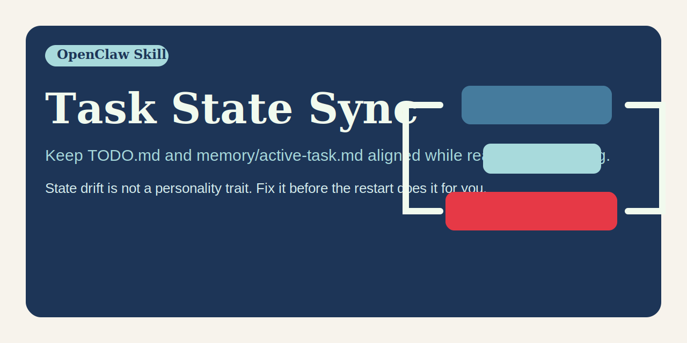

# Task State Sync

English | [简体中文](README.zh-CN.md)




An OpenClaw skill for keeping multitask continuity files accurate while work is still moving.

## Quick pitch

Keep `TODO.md` and `memory/active-task.md` aligned while real work is moving.
State drift is not a personality trait. Fix it before the restart does it for you.

## Why this exists

Agents are often decent at doing work and embarrassingly bad at maintaining the state needed to resume that work later. The result is familiar: `TODO.md` drifts out of date, `memory/active-task.md` points at yesterday's problem, finished tasks keep haunting the queue, and restarts turn active work into archaeology.

`task-state-sync` exists to stop that slow-motion memory corruption.

It teaches an agent when to write durable task state, what belongs in `TODO.md` versus `memory/active-task.md`, and how to keep those files aligned as priorities, blockers, and next steps change during real multitask execution.

## Works independently

`task-state-sync` is deliberately narrow but fully useful on its own.

Use it when your main problem is state drift rather than scheduling. Even without any companion skill, it already gives you a disciplined way to:

- keep `TODO.md` accurate
- keep `memory/active-task.md` accurate
- preserve important IDs for later recovery
- clean out stale finished work
- reduce restart confusion

It does not require `task-orchestrator` or `multi-task-continuity` to be useful. Those repos simply pair well with it.

## Family role

Within this repo family, `task-state-sync` is the continuity-file maintenance specialist.

Use it when the main problem is stale state, missing IDs, or drift between `TODO.md` and `memory/active-task.md`.
Do not bloat it into a scheduler just because the bug happened during multitask work.

## What the skill teaches

The skill tells the agent to:

- sync continuity files on material state changes, not after every tiny step
- use `TODO.md` as the per-chat unfinished queue
- use `memory/active-task.md` as the single resume-first scratchpad
- record important IDs when they first appear
- remove stale or completed work instead of preserving historical nonsense in live state files
- prepare restart-safe state before resets and intentional restarts

## When to use it

Use `task-state-sync` when:

- an agent is juggling multiple tasks across messages
- work should survive restarts or session resets
- the top priority changed during execution
- a blocker appears or clears
- important IDs need to be preserved for later recovery
- `TODO.md` and `memory/active-task.md` risk drifting apart

## Example behavior

### Example 1: new blocker appears

A background run fails and returns a session ID and log path.

A good agent should:

1. update `TODO.md` with the blocker and the next diagnostic step
2. decide whether that failure is now the top task
3. if yes, rewrite `memory/active-task.md` to make it the resume-first lane
4. record the session ID and log path where future recovery will need them

### Example 2: urgent task preempts the queue

A user sends a new production issue while other work is running.

A good agent should:

1. rewrite the current chat section in `TODO.md`
2. demote the old task to secondary work instead of deleting it
3. promote the urgent issue to `memory/active-task.md`
4. update the post-restart resume sentence to match reality

### Example 3: task completion

A previously active publish flow succeeds.

A good agent should:

1. remove the finished item from `TODO.md`
2. rewrite the remaining queue if other work is still active
3. clear `memory/active-task.md` if no top task remains

## Related skills

These are related, not required:

- `task-orchestrator`: adds scheduling, prioritization, and staged progress policy - <https://github.com/ruanrrn/task-orchestrator>
- `multi-task-continuity`: bundles scheduling plus state sync plus restart-safe recovery - <https://github.com/ruanrrn/multi-task-continuity>

Use this repo alone if state drift is the main pain.

## Social preview

Suggested social preview asset: `assets/social-preview.svg`

Suggested one-line copy:

> Keep `TODO.md` and `memory/active-task.md` aligned while real work is moving.

GitHub note:

- The current `gh` CLI and GraphQL `UpdateRepositoryInput` do not expose a writable custom social preview field.
- To use this image as the repository social preview, upload `assets/social-preview.svg` manually in the repo settings UI.

## What you get

- `task-state-sync/` - the skill source
- `dist/task-state-sync.skill` - packaged artifact ready to import

## Install

Use either path:

1. Import `dist/task-state-sync.skill` into an OpenClaw environment.
2. Copy `task-state-sync/` into your skills directory if you want the editable source.

## Repository layout

```text
task-state-sync/
├── LICENSE
├── README.md
├── README.zh-CN.md
├── CONTRIBUTING.md
├── assets/
│   └── social-preview.svg
├── task-state-sync/
│   └── SKILL.md
└── dist/
    └── task-state-sync.skill
```

## Contributing

See `CONTRIBUTING.md` for contribution scope, PR expectations, and how to keep this repo focused on state accuracy rather than broad orchestration policy.

## Release hygiene

- Regenerate `dist/task-state-sync.skill` after each material skill change
- Keep the repository focused on state-sync behavior, not broad orchestration policy
- Keep README examples aligned with the actual sync rules in `task-state-sync/SKILL.md`
- Keep the public presentation clean, bilingual, and independently understandable

## Repository

- GitHub: `https://github.com/ruanrrn/task-state-sync`
- License: MIT
